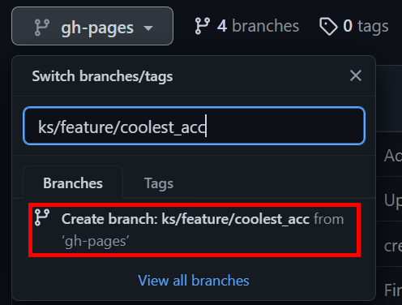
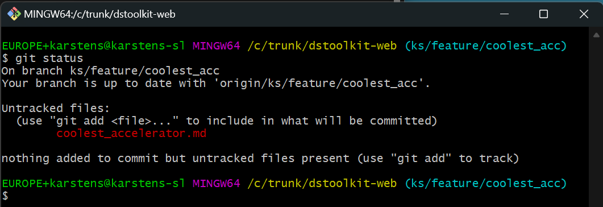

# Guide on How to Create a New Accelerator Page

## Purpose

- Add a new accelerator page to the toolkit web site. Insure it shows on on the Toolkit page and make sure the contributors are displayed, both on the actual accelerator page and on the contributor's page.
- Show how to set up a local environment, so the page/site can be tested locally. It is important to ensure all looks good and is working before pushing your new branch to GitHub and creating a new Pull Request (to be reviewed and merged into the main branch).

This guide is not a git tuturial. It assumes a working knowledge of git. On the actual [site](https://microsoft.github.io/dstoolkit-web) there are a couple of instruction videos that will explain topics such as how to install git (and an editor) as well as how to clone a repo etc. There will be a few hints/guidelines along the way to ensure the reader can follow along.

## Create Page
Log into *GitHub* and go to the site repo found here: [microsoft/dstoolkit-web](https://github.com/microsoft/dstoolkit-web).

To go the *Code* tab


Create a new branch. This can either be done from the web site as shown below. Make sure you create the new branch from the main branch called *gh-pages*. Enter the name and click the *Create branch* button/link.



>It is recommended to work locally.

Start by cloning the repo to your local disk. This is done using the command `git clone https://github.com/microsoft/dstoolkit-web`.


To create a new branch from the commandline open e.g. git bash. Make sure the main branch is checkout out (the *gh-pages* branch) and that you have pulled the latest code. Enter the commands

```
git checkout gh-pages
git pull
git checkout -b "ks/feature/coolest_acc"
```

as shown below


If you have created the branch on your own machine it should now be checked out. If you are not switch to the branch using the command `git checkout coolest_acc` or `git switch coolest_acc`.


Create a new page by making a copy of the template file *DEMO-SingleAcceleratorPage.md*. Rename the file to the (short) name of your accelerator, e.g. *coolest_accelerator.md*

Using the command

```
git status
```

You can check that the page is created. It is still untracked by git as you have not yet added it to git (nor committed the change).



Now add and commit the file to git using the commands:

```
git add .
git commit -m "Add new accelerator page for Coolest Accelerator"
```


> If you have not read the pages on the [Toolkit-site](https://microsoft.github.io/dstoolkit-web/howtocontribute/) on recommendations on how to contribute, now is the time. 

> Especially the section that explains the *SST Git Flow* as well as the *List Of Practices*

The new file and subsequent changes should be pushed to the repo on GitHub.

This is done using the command `git push`.


Please note, that you may be asked to set the upstream location. You will be told and if so just past the command shown and execute it. The command will look like this:

```
git push --set-upstream origin ks/feature/coolest_acc
```

Load the new accelerator page into an editor. Notepad++ or VS Code or Notepad if that is your prefered choice.

At the top of the page you will find three options:

- layout
- title
- permalink

The *layout* you should keep as is (*pageAccelerator*).

The *title* should be set to the name of our accelerator, e.g. *Coolest Accelerator*.

The *permalink* should be set to the name of the accelerator page you are currently working on inside /.../ , e.g. */coolest_accelerator/*

So it would look something like this:

```
---
layout: pageAccelerator
title: Coolest Accelerator
permalink: /coolest_accelerator/
---
```

At this point in time you can view the page locally. If you follow the instructions below. Note, that as the page is not yet linked to the Toolkit-page, you will have to enter the permalink in the address bar. In our case it would be `http://localhost:4000/dstoolkit-web/coolest_accelerator`

If the page loads you should see a lot of 'TODO' fields and other template text. Adding and amending the accelerator page you have just created will change this.

> Some variables/placeholders are in double quotes and some are in single quotes; these are prefixed by 'html'. 

Depending on where the variable or placeholder is used the value will be in single or double quotes. It is very important to maintain these as the page will otherwise not display correctly. Look at one of the existing pages to see examples of how the text is used and formatted. In the html-variables it is possible to use html to format and include images.

The main variables are:

- textPageTitle
- htmlPageDescription
- srcHeaderImage
- linkAccessAcceleratorRepo
- htmlAcceleratorDescription
- listLinksRelatedAccelerators

*textPageTitle* is the main title of the page. Most likely this will be the name of the accelerator, so here "Coolest Accelerator"

*htmlPageDescription* is a short description, not to be confused with the *htmlAcceleratorDescription*. An example from the Vitastic accelerator: "Quickly build web-interfaces for object detection, segmention, and classification models".

*srcHeaderImage* is the path to the image used on top of the page. Place images in a dedicated subfolder of *images*. The path will have to be pre-fixed with `{{site.baseurl}}` so the full value would be something like `{{site.baseurl}}/images/coolestaccelerator/topbanner.png`.

> Images has to be scaled correctly. Check dimentions on images for an existing accelerator

*linkAccessAcceleratorRepo* is the link to the GitHub repo. It is also used to display the contributors. So for this repo (the dstoolkit-web) it would be `https://github.com/microsoft/dstoolkit-web`

*listLinksRelatedAccelerators* is a list of related accelerators. The links should be to the GitHub pages (of existing accelerators), and not the repositories. If we look at the variable for the *Knowledge Mining* page the value is:

```
const listLinksRelatedAccelerators = ["/anomaly-detection/", "/verseagility/","/object-detection/"];
```

Please notice the syntax. The script file `script-setsingleacceleratorpagecontents.js` uses this list to create display names, hence you may need to update this file too.

If you look at your page, and the display names for the related accelerators are the actual links and now a 'nice' display name, you will have to update the js-file.

- Open the page `scripts/script-setsingleacceleratorpagecontents.js`
- Scroll down and find the section `//<!--Link to Related Accelerator(s)-->`
- Add a new `else-if` statement block if linking to a related accelerator that does not already exist.

The final thing to update is the Boolean section `//boolean variables to show / hide sections of the page` at the end of the page. Determine if you need a section or not. If you set the value to **false** the section will be shown. Note, that both *false* and *true* should be written in lowercase. 

## Update Toolkit Page

## Setup local test environment

