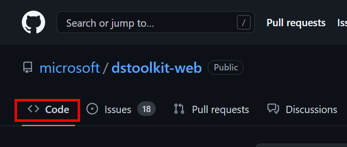

# Guide on How to Create a New Accelerator Page

## Purpose

- Add a new accelerator page to the toolkit web site. Insure it shows on on the Toolkit page and make sure the contributors are displayed, both on the actual accelerator page and on the contributor's page.
- Show how to set up a local environment, so the page/site can be tested locally. It is important to ensure all looks good and is working before pushing your new branch to GitHub and creating a new Pull Request (to be reviewed and merged into the main branch).

This guide is not a git tuturial. It assumes a working knowledge of git. On the actual [site](https://microsoft.github.io/dstoolkit-web) there are a couple of instruction videos that will explain topics such as how to install git (and an editor) as well as how to clone a repo etc. There will be a few hints/guidelines along the way to ensure the reader can follow along.

## Create Page
Log into *GitHub* and go to the site repo found here: [microsoft/dstoolkit-web](https://github.com/microsoft/dstoolkit-web).

To go the *Code* tab

Create a new branch. This can either be done from the web site as shown below. Make sure you create the new branch from the main branch called *gh-pages*.

To create a new branch from the commandline open e.g. git bash. Make sure the main branch is checkout out (the *gh-pages* branch) and enter the command
> git checkout -b "ks/feature/coolest_acc"

## Update Toolkit Page

## Setup local test environment

